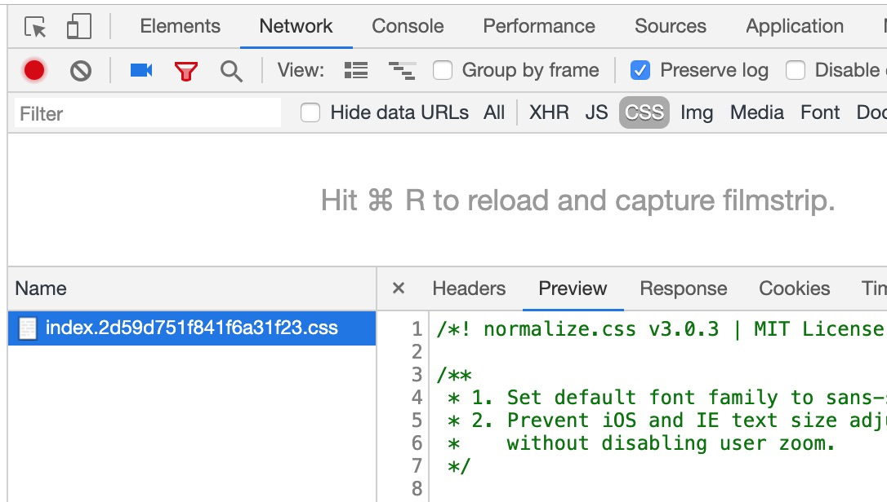
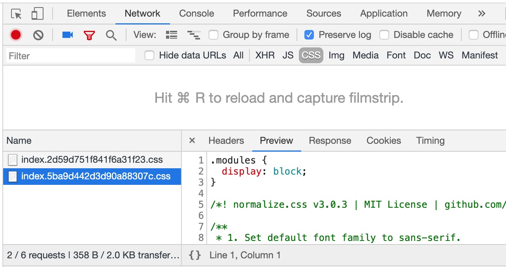
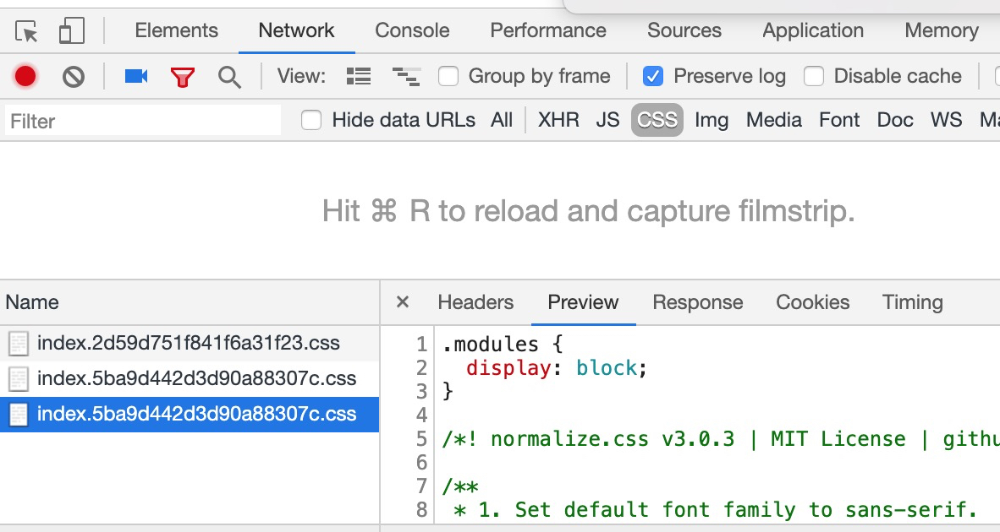

#mini-css-extract-plugin 406 case repo
##The environment

* Operating System:mac os 10.14.4
* Node Version:8.9.0
* NPM Version:6.8.0
* webpack Version:4.16.5
* mini-css-extract-plugin Version:0.7.0

##How to operate
1. npm install
2. npm start
4. open browser check css like（open Preserve log）

3. open file 'src/pages/index/index.js'
4. change code
	
	```
	
	import './a.less';  
	import '../../modules/modules.less';  
	//import './a.less';  
	
	```
	to
	
	```
	
	//import './a.less';  
	import '../../modules/modules.less';  
	import './a.less';  
	
	```
5. refresh the browser and check css

6. change code
	
	```
	
	//import './a.less';  
	import '../../modules/modules.less';  
	import './a.less';  
	
	```
	to
	
	```
	
	import './a.less';  
	import '../../modules/modules.less';  
	//import './a.less';  
	
	```
5. refresh the browser and check css


The third time it didn't change

##reason
in webpack/lib/Compilation.js

```

seal(callback){
	...
	this.sortItemsWithModuleIds();
	...
}

```
it will call `Array.sort` with `sortModuleById`.it will Returns 0 when the number is compared to a string.Different sorts have the same result
 in the node8.9.0(Specific order and length). node12 is correct and return to the original array
 
  
 


